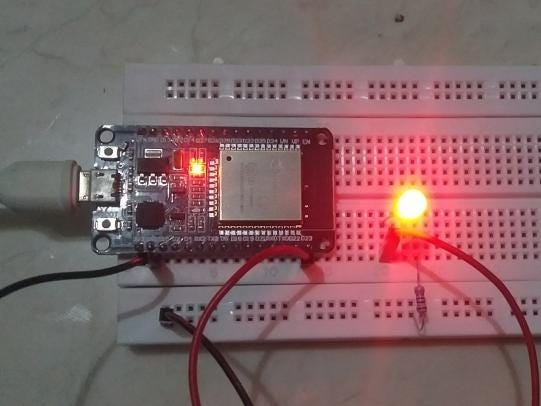
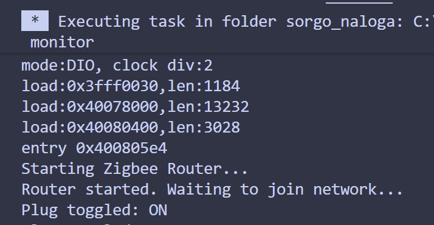

# Zigbee komunikacijski protokol v esp32
Zigbee je komunikacijski protokol kratkega dosega, ki omogoča povezavo med napravimi, vključno z esp32.

## Opis
Ko želimo izmenjavati podatke s pomočjo esp32 z malo poraba energije in virvo, je najbolj primerna rešitev Zigbee. Zigbee tvori mrežna povezavo z vsemi napravami v omrežju. Vsaka naprava spada v eno izmed treh tipov:

- Coordinator - Komunicira, nadzoruje in hrani naslove vseh naprav v omrežju.
- Router - Komunicira z drugimi napravi in posreduje sporočilo
- End device - Naprava ki samo prejema/pošilja podatke. Običajno deluje v low-power načinu.


### Primer topologije omrežja zigbee: 

    ┌─────────────────┐       ┌─────────────────┐       ┌─────────────────┐  
    │   Coordinator   │◄─────►│     Router      │◄─────►│     Router      │  
    │   (Gateway)     │       │   (Repeater)    │       │  (Thermostat)   │  
    └─────────────────┘       └─────────────────┘       └─────────────────┘  
            │                          │                         │  
            │                          ▼                         │  
            │                 ┌─────────────────┐                │  
            │                 │   End Device    │                │  
            │                 │    (Sensor)     │                │  
            │                 └─────────────────┘                │  
            │                                                    │  
            ▼                                                    ▼  
    ┌─────────────────┐                                 ┌─────────────────┐
    │   End Device    │                                 │   End Device    │
    │   (Sensor)      │                                 │    (Sensor)     │
    └─────────────────┘                                 └─────────────────┘


## Zakaj zigbee?

Obstaja veliko komunikacijskih protokolov ki se lahko uporabljajo pri ESP (npr Wifi ali blutooth). Zigbee je koristen ko je število naprav veliko in se te nahajajo v manjšem območju (zigbee ima domet od 10 do 100m). Je zanesljiv, kar pomeni da tudi če ima ena naprava okvaro, lahko omrežje vseeno deluje.

## Prednosti in slabosti
### Prednosti
- Visoka skalabilnost
- Nizka poraba energije
- Zanesljivost

### Slabosti
- Počasen prenos podatkov
- Domet od 10m do 100m
## Število uporabnikov, časovna in prostorska zahtevost
Uporablja se za "smart home". To se pravi za pametne luči, stikala, termostat, tv...
<br >

Primer: Amazon Echo

Prostorska zahtevnost je mala. par c++ knižnic, manj kot 10mb

Časovno zahtevnost je globina mreže t.j najdalša pot med napravama

## Vzdrežavanje
Zigbee knižnico za esp32 vzdržuje več razvijalcev podjetja Espressif (nekje 4 redni razvijalci), nazadnji commit na repositorije je bil pred 3 tedni.

## Licenca
(Licence posredno preko Arduino IDE)
Apache License
Version 2.0, January 2004
http://www.apache.org/licenses/

## Primer uporabe

### Zgled funkcij


Zgled vezave na breadbordu (router):  
  
Zgled izpisa v konzolo ob pritiska na boot gumb pri coordinatorju.  
  

### Zlged kode routerja
```c++
#ifndef ZIGBEE_MODE_ROUTER
#error "Zigbee Router mode is not selected in Tools -> Zigbee Mode"
#endif
#include "Zigbee.h"

#define PLUG_PIN 8 
#define BUTTON_PIN 9 
ZigbeeSwitch zbPlug = ZigbeeSwitch(17); 

void setup() {
Serial.begin(115200);

pinMode(PLUG_PIN, OUTPUT);
pinMode(BUTTON_PIN, INPUT_PULLUP);

zbPlug.setManufacturerAndModel("Espressif", "ESP32C6-SmartPlug");
zbPlug.onChange(funcPlugChange);
Zigbee.addEndpoint(&zbPlug);
Serial.println("Starting Zigbee Router...");

if (!Zigbee.begin()) {
    Serial.println("Zigbee failed to start!");
    while (1);
}
Serial.println("Router started. Waiting to join network...");
}

void loop() {  
if (digitalRead(BUTTON_PIN) == LOW) {
    delay(100); 
    if(digitalRead(BUTTON_PIN) == LOW) {
        bool currentState = digitalRead(PLUG_PIN);
        funcPlugChange(!currentState);
        zbPlug.report(); 
        while(digitalRead(BUTTON_PIN) == LOW); /
    }
}
}

void funcPlugChange(bool state) {
Serial.printf("Plug toggled: %s\n", state ? "ON" : "OFF");
digitalWrite(PLUG_PIN, state ? HIGH : LOW);
}

```  

### Zgled kode coordinatorja
```c++
    #ifndef ZIGBEE_MODE_COORDINATOR
#error "Zigbee Coordinator mode is not selected in Tools -> Zigbee Mode"
#endif

#include "Zigbee.h"

#define BUTTON_PIN 9 

ZigbeeSwitch zbRemote = ZigbeeSwitch(1);


uint16_t lightAddress = 0xFFFF; // 0xFFFF means unknown
uint8_t  lightEndpoint = 0;

void setup() {
  Serial.begin(115200);
  pinMode(BUTTON_PIN, INPUT_PULLUP);

  zbRemote.setManufacturerAndModel("Espressif", "ESP32C6-Remote");
  Zigbee.addEndpoint(&zbRemote);

  Serial.println("Starting Zigbee Coordinator...");

  if (!Zigbee.begin(false)) { // v primeru ce ne spila 
    Serial.println("Failed to start Zigbee!");
    while (1);
  }

  Zigbee.setRadioConfig(ZIGBEE_RADIO_NATIVE, 20); 

  Serial.println("Coordinator started!");
  Serial.println("Press BOOT button to Toggle lights.");
}

void loop() {
  if (digitalRead(BUTTON_PIN) == LOW) {
    delay(50); 
    if (digitalRead(BUTTON_PIN) == LOW) {
      Serial.println("Button Pressed!");
      toggleBoundLights();
      
      while (digitalRead(BUTTON_PIN) == LOW); 
    }
  }
}

void toggleBoundLights() {
  if (lightAddress == 0xFFFF) {
    Serial.println("Scanning for On/Off Lights...");
   
    zigbee_endpoint_info_t info = Zigbee.findEndpoint(ESP_ZB_HA_ON_OFF_LIGHT_DEVICE_ID);
    
    if (info.short_addr != 0xFFFF) {
      lightAddress = info.short_addr;
      lightEndpoint = info.endpoint;
      Serial.printf("Found Light at Addr: 0x%04X, Endpoint: %d\n", lightAddress, lightEndpoint);
      
      zbRemote.bind(lightAddress, lightEndpoint);
    } else {
      Serial.println("No lights found yet. Make sure the Light is powered on.");
      return;
    }
  }
  Serial.println("Sending TOGGLE command...");
  zbRemote.toggle(lightAddress, lightEndpoint);
}

```  

## Uporaba v projektu  

Naš projekt uporablja esp32 za merjenje teže panjev. Z pomočjo Zigbee se bojo tile podatki zbrali na enega coordinatorja, ko bo poslal en veliki "paket" vseh naših podatkov na API. 

### Naša topologija  
Število naprav je poljubno.
```                           
                                  ┌─────────────────┐     
                                  │   End Device    │     
                                  │    (Esp32)      │     
                                  └─────────────────┘   
                                        ▲
                                        │               
        ┌─────────────────┐       ┌─────────────────┐       ┌─────────────────┐  
        │   End Device    │◄───── │   Coordinator   │ ─────►│   End Device    │  
        │   (Esp32)       │       │   (Esp32)       │       │  (Esp32)        │  
        └─────────────────┘       └─────────────────┘       └─────────────────┘  
                                        │              
                                        ▼              
                                  ┌─────────────────┐     
                                  │   End Device    │     
                                  │    (Esp32)      │     
                                  └─────────────────┘    
```